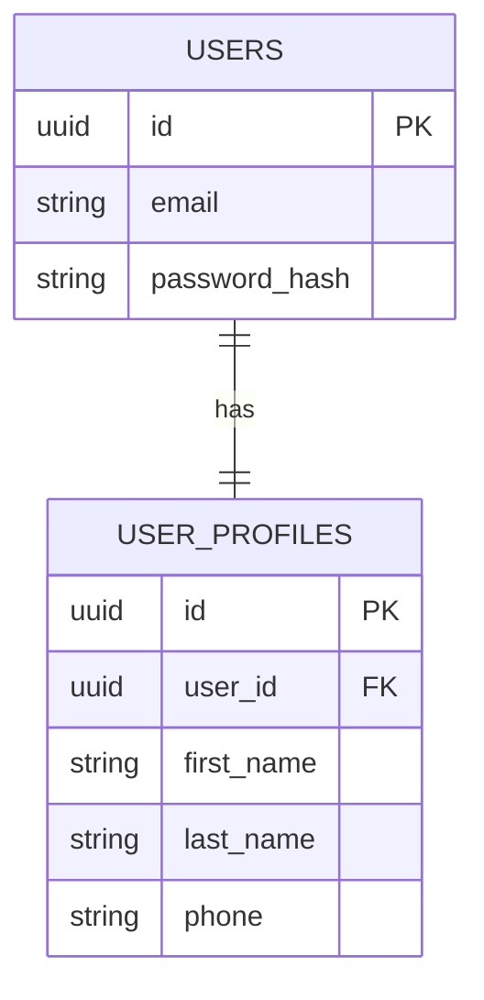
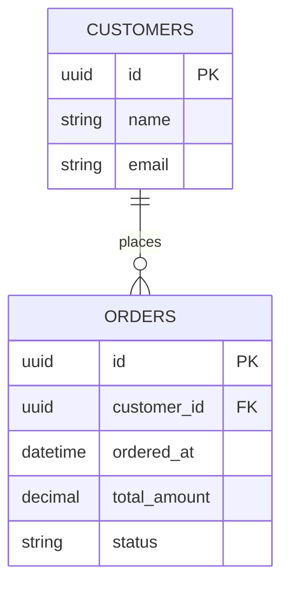
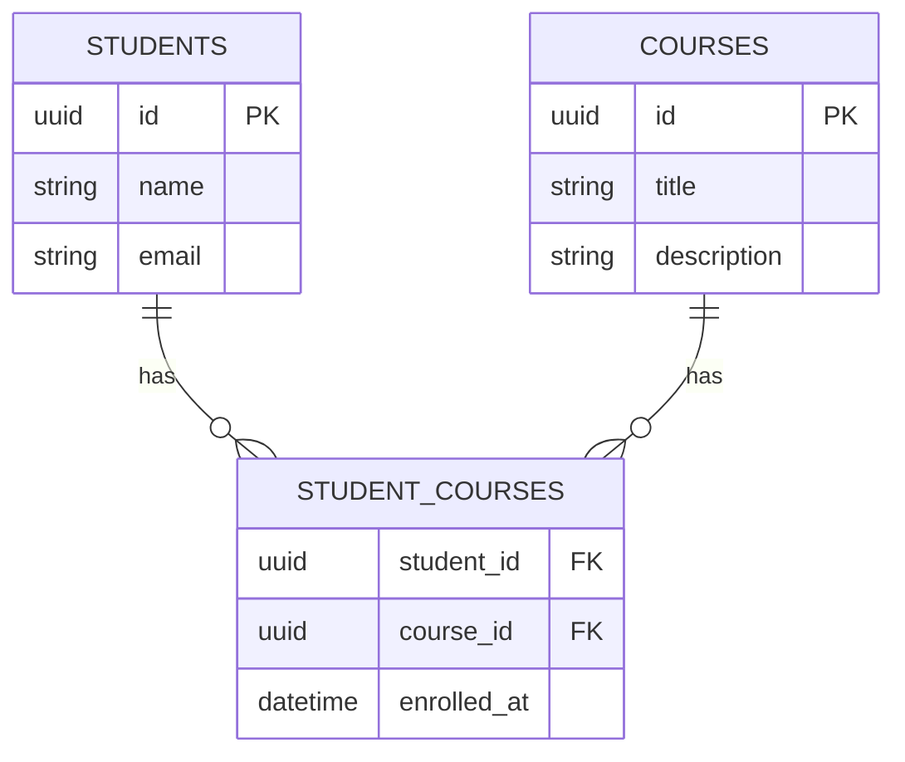
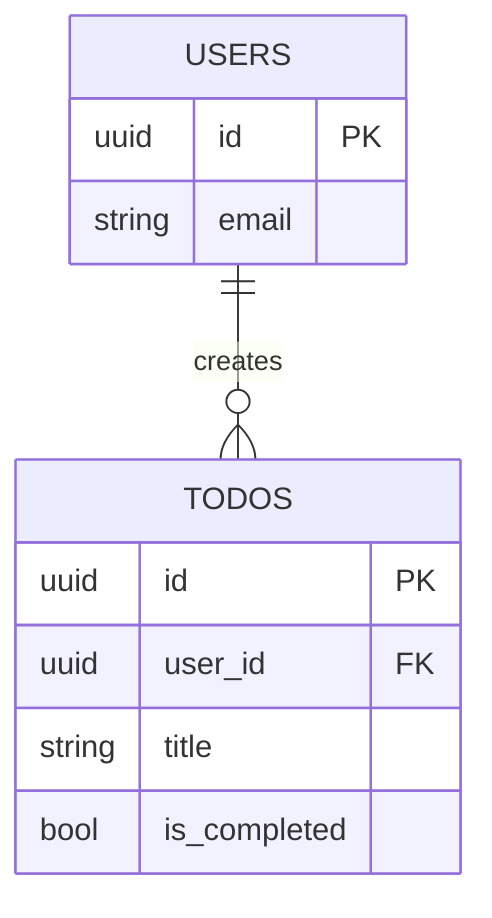
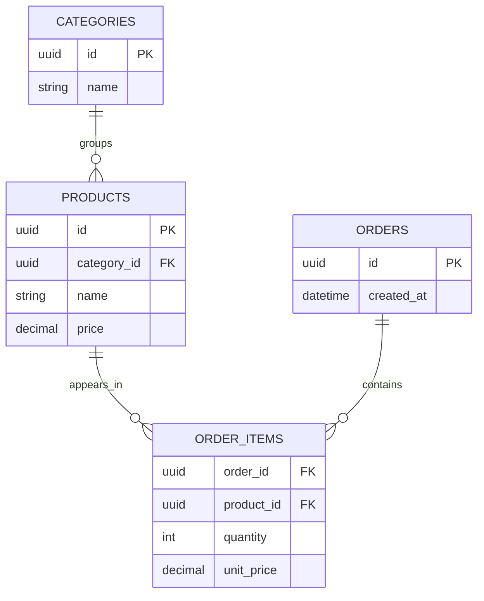

# Database Relationships

Database relationships describe how tables connect to each other.

The main relationship types are:

- One-to-one
- One-to-many
- Many-to-many

## Common terms

| Term | Meaning |
| --- | --- |
| Primary Key | Unique value that identifies one row in a table |
| Foreign Key | A column that points to the primary key of another table |
| Parent Table | The main table being referenced |
| Child Table | The table that stores the foreign key |

Example:

```text
Customers.Id        -> primary key
Orders.CustomerId   -> foreign key
```

`Orders.CustomerId` points to `Customers.Id`.

## 1. One-to-one relationship

One row in table A connects to only one row in table B.

Example:

- One `User` has one `UserProfile`
- One `UserProfile` belongs to one `User`



### Tables

`Users`

| Id | Email |
| --- | --- |
| `user-1` | `amal@example.com` |

`UserProfiles`

| Id | UserId | FirstName | LastName |
| --- | --- | --- | --- |
| `profile-1` | `user-1` | Amal | Perera |

### Why use one-to-one?

Use one-to-one when extra details should be stored separately from the main table.

Common examples:

- `User` and `UserProfile`
- `Employee` and `EmployeeContract`
- `Student` and `StudentIdentityCard`

### SQL idea

```sql
CREATE TABLE users (
    id uuid PRIMARY KEY,
    email text NOT NULL
);

CREATE TABLE user_profiles (
    id uuid PRIMARY KEY,
    user_id uuid UNIQUE NOT NULL REFERENCES users(id),
    first_name text NOT NULL,
    last_name text NOT NULL
);
```

Important part:

```sql
user_id uuid UNIQUE NOT NULL REFERENCES users(id)
```

`UNIQUE` makes sure one user can have only one profile.

## 2. One-to-many relationship

One row in table A connects to many rows in table B.

Example:

- One `Customer` has many `Orders`
- One `Order` belongs to one `Customer`



### Tables

`Customers`

| Id | Name | Email |
| --- | --- | --- |
| `customer-1` | Amal | `amal@example.com` |
| `customer-2` | Nimal | `nimal@example.com` |

`Orders`

| Id | CustomerId | OrderedAt | TotalAmount | Status |
| --- | --- | --- | --- | --- |
| `order-1` | `customer-1` | 2026-07-14 | 75000 | Paid |
| `order-2` | `customer-1` | 2026-07-15 | 25000 | Pending |
| `order-3` | `customer-2` | 2026-07-15 | 15000 | Paid |

Here, `customer-1` has two orders.

### Why use one-to-many?

Use one-to-many when one parent record can own many child records.

Common examples:

- `Customer` and `Order`
- `Author` and `Book`
- `Department` and `Employee`

### SQL idea

```sql
CREATE TABLE customers (
    id uuid PRIMARY KEY,
    name text NOT NULL,
    email text NOT NULL
);

CREATE TABLE orders (
    id uuid PRIMARY KEY,
    customer_id uuid NOT NULL REFERENCES customers(id),
    ordered_at timestamp NOT NULL,
    total_amount numeric(18, 2) NOT NULL,
    status text NOT NULL
);
```

Important part:

```sql
customer_id uuid NOT NULL REFERENCES customers(id)
```

Many orders can store the same `customer_id`.

## 3. Many-to-many relationship

Many rows in table A can connect to many rows in table B.

Example:

- One `Student` can join many `Courses`
- One `Course` can have many `Students`

For this, we need a third table called a join table.



### Tables

`Students`

| Id | Name |
| --- | --- |
| `student-1` | Nimal |
| `student-2` | Kavindi |

`Courses`

| Id | Title |
| --- | --- |
| `course-1` | C# Basics |
| `course-2` | EF Core |

`StudentCourses`

| StudentId | CourseId | EnrolledAt |
| --- | --- | --- |
| `student-1` | `course-1` | 2026-07-14 |
| `student-1` | `course-2` | 2026-07-14 |
| `student-2` | `course-1` | 2026-07-14 |

Here:

- Nimal is enrolled in two courses
- C# Basics has two students

### Why use many-to-many?

Use many-to-many when both sides can have many records from the other side.

Common examples:

- `Student` and `Course`
- `Product` and `Order`
- `User` and `Role`
- `Book` and `Author`

### SQL idea

```sql
CREATE TABLE students (
    id uuid PRIMARY KEY,
    name text NOT NULL,
    email text NOT NULL
);

CREATE TABLE courses (
    id uuid PRIMARY KEY,
    title text NOT NULL,
    description text
);

CREATE TABLE student_courses (
    student_id uuid NOT NULL REFERENCES students(id),
    course_id uuid NOT NULL REFERENCES courses(id),
    enrolled_at timestamp NOT NULL,
    PRIMARY KEY (student_id, course_id)
);
```

Important part:

```sql
PRIMARY KEY (student_id, course_id)
```

This prevents the same student from being added to the same course twice.

## Relationship symbols in Mermaid

```mermaid
erDiagram
    ONE ||--|| ONE_OTHER : "one-to-one"
    ONE_PARENT ||--o{ MANY_CHILDREN : "one-to-many"
    MANY_LEFT }o--o{ MANY_RIGHT : "many-to-many"
```

| Symbol | Meaning |
| --- | --- |
| `||` | Exactly one |
| `o|` | Zero or one |
| `|{` | One or many |
| `o{` | Zero or many |

## Quick comparison

| Relationship | Example | Foreign key location |
| --- | --- | --- |
| One-to-one | User -> UserProfile | Usually child table with `UNIQUE` |
| One-to-many | Customer -> Orders | Many side table |
| Many-to-many | Students -> Courses | Join table |

## Simple rule

Ask this question:

Can one record connect to many records?

- No on both sides: one-to-one
- Yes on one side only: one-to-many
- Yes on both sides: many-to-many

## Course project examples

For a todo app:



One user can create many todos.

For a product app:



`Orders` and `Products` become many-to-many through `OrderItems`.
